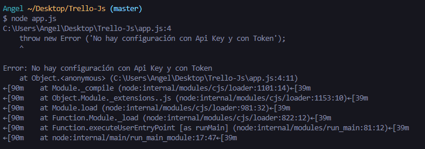

# Trello JS

## Crear un proyecto con configuración externalizada

* Se creó un proyecto de js.
* Se instaló la siguiente dependencia que nos ayudará a tener la configuración externalizada:

```
npm install dotenv --save
```

* Se creo un archivo llamado `app.js` y dentro se añadio el siguiente script:

```
require('dotenv').config()

if(!process.env.TOKEN && !process.env.KEY){
  throw new Error('No hay configuración con Api Key y con Token')
}
```

En la primera línea se llama la dependencia que se instaló y se crea una condición en dado caso que no haya una configuración con el API key y el token. Si se ejecuta el comando `node app.js` antes de crear el archivo .env y configurarlo con los parámetros TOKEN y KEY se mostrará el siguiente error:



Por tal motivo se creó el archivo .env en la raíz del proyecto y se agregó el API KEY y TOKEN de Trello.

`Archivo .env`

```
KEY="TrelloKeyHere"
TOKEN="Trellotokenhere"
```

Después se creó el archivo .gitignore y se agregó el archivo .env ya que como tiene información sensible nunca se versiona.

## Agregar la dependencia de Trello y explora que se puede hacer

Con el siguiente comando se agrega la dependencia de Trello:

```
npm install trello --save
```

Una vez instalada la dependencia de Trello se agrega el siguiente ejemplo en el archivo app.js

```
let Trello = require("trello");
let trello = new Trello(process.env.KEY, process.env.TOKEN);

let cardTitle = `Card Nueva ${new Date()}`

trello.addCard(cardTitle, "LaunchX Card Description", "IDLIST",
	function (error, trelloCard) {
		if (error) {
			console.log('Could not add card:', error);
		}
		else {
			console.log('Added card:', trelloCard);
		}
	});
```

La primera línea añadida nos permite importar la dependencia de Trello, en la segunda línea se hace uso de la variable creada anteriormete y se utilizan como parámetros los datos del API KEY y el TOKEN que han sido creados en el archivo `.env`.
Después se crea una variable llamada cardTitle y se le asigna el nombre de card nueva junto con el método para obtener la fecha de tal modo que cuando se cree una nueva card aparezca con la fecha con la que fue creada.

Despues se hace uso de la variable trello junto a la función addCard y se manda los siguientes parámetros:

* cardTitle: Nombre del nuevo card junto la fecha en que fue creada.
* Descripción de la card: Se envía la descripción de la card, en este caso es "LaunchX Card Description".
* idList: El último parámetro que se envía es el idList, el cuál es el ID de la columna en donde queremos agregar la nueva card. En este caso la columna en donde se agregará la nueva card será en "Lista de tareas".

Después se crea una función que tiene como parámetros error y trelloCard y luego una condición, en donde al momento de agregar una nueva card hay un error se mostrará en consola el mensaje "Could not add card" junto a su error y por otro lado si todo esta correcto se mostrará en consola "Added card", como se muestra a continuación:


*Nota: Si en dado caso obtenemos un error lo más probable es que se haya agregado mal el IDLIST.*

En el proyecto anterior [API-REST-Trello](https://github.com/AngelDiaz-21/API-REST-Trello), las peticiones fueron realizadas mediante postman, así que ahora se harán algunas peticiones pero con código, como el anterior en donde se ha creado una nueva card.

### Función para agregar un nuevo card

```
trello.addCard(cardTitle, "LaunchX Card Description", listId,
	function (error, trelloCard) {
		if (error) {
			console.log('Could not add card:', error);
		}
		else {
			console.log('Added card:', trelloCard);
		}
	});
```

Para esta función como se vio anteriormente se necesitan los siguientes parámetros:

* cardTitle (título del card).
* La descricpción.
* ListId (id de la lista) en donde se va a crear.

### Función para eliminar un card

```
trello.deleteCard(deletecardId,
function (error, trelloCard) {
		if (error) {
		console.log('Could not delete card:', error);
	}
	else {
			console.log('Delete card:', trelloCard);
		}
	});
```

Para esta función solo se necesita el id del card del que se desea a eliminar.

### Función para actualizar un card

```
trello.updateCardName(cardIdUpdated, nameUpdatedCard,
function (error, trelloCard) {
	if (error) {
		console.log('Updated not card:', error);
	}
	else {
		console.log('Updated card:', trelloCard);
	}
});
```

Esta función es especificamente para actualizar el nombre del card, para esta función se necesita los siguientes parámetros:

* cardIdUpdated: Id del card que se desea actualizar
* nameUpdatedCard: El nuevo nombre.

Existen otras funciones, por ejemplo, para actualizar la descripción o el list pero también existe otra función en general en donde se tiene que indicar el campo y el valor que se desea actualizar.

```
trello.updateCard(cardIdUpdated, "name", nameUpdatedCard,
function (error, trelloCard) {
	if (error) {
		console.log('Updated not card:', error);
	}
	else {
		console.log('Updated card:', trelloCard);
	}
});
```

Como segundo parámetro recibe un field (campo) y un value (valor). En este ejemplo se uso también para actualizar el nombre pero se podría usar para cambiar la descripción o el list, cabe aclarar que ya existen sus respectivas funciones y se pueden encontrar como `updateCardDescription`, `updateCardList `.

### Función para obtener los datos de un card

```
trello.getCard(boardId, cardIdGetCard,
function (error, trelloCard) {
	if (error) {
		console.log('No get card:', error);
	}
	else {
		console.log('Get card:', trelloCard);
	}
});
```

Esta función permite obtener los datos de un card, para esto se necesita pasarle los siguientes parámetros:

* boardId: Id del board.
* cardIdGetCard: Id del card que se necesita.

### Función para obtener los datos de un card por el ID

```
trello.getCardById(cardIdGetCard,
function (error, trelloCard) {
	if (error) {
		console.log('No get card by id:', error);
	}
	else {
		console.log('Get card by id:', trelloCard);
	}
});
```

También existe una función especialmente para obtener la información de un card mediante el ID.

### Función para obtener todas las listas de un board por filtro

```
trello.getListsOnBoardByFilter(boardId, "open", (err, lists) => {
    if (err) console.error(err)
  
    console.log(lists)
})
```

Para esta función se necesitan los siguientes parámetros:

* boardId: El Id del board.
* filter: Mediante que filtro se van a obtener las listas del board, en el ejemplo se están filtrando mediante "open", es decir, todas las que estén abiertas.

### Función para obtener todos los boards

```
trello.getBoards(memberID,
function (error, trelloCard) {
	if (error) {
		console.log('No get boards:', error);
	}
	else {
		console.log('Get boards:', trelloCard);
	}
});
```

Esta función permite obtener todos los boards que se tengan en el tablero, así ya sea que estén cerrados o no.
Como único parámetro se necesita el id del miembro.

* Se cuenta con la documentación para explorar que más se puede hacer con esta app.
  [https://github.com/norberteder/trello](https://github.com/norberteder/trello)
